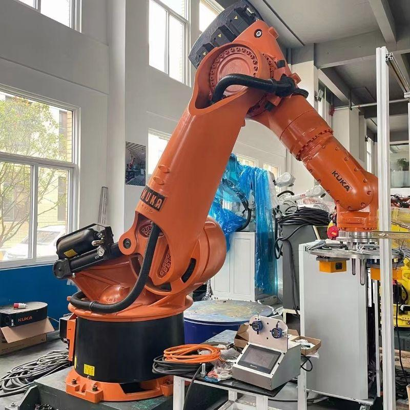

## KUKA KR 360 in RoboDK

<p align="center">
  
</p>

<p align="center">
<b>Figure 1.</b> KUKA KR 360 robot imported into RoboDK.
</p>

### Description

The **KUKA KR 360** is a six-axis industrial robot used for heavy-duty
manufacturing tasks. In RoboDK, it serves as a digital twin that enables:

- Offline programming
- Robot path planning
- Collision detection
- Pick-and-place simulation
- Cycle time estimation
- Python API integration
- ROS/ROS 2 communication
- Reinforcement Learning research
- Sim-to-Real validation

### Specifications

| Property | Value |
|----------|-------|
| Manufacturer | KUKA |
| Robot Type | 6-axis Industrial Robot |
| Payload | 240 kg |
| Reach | 2825 mm |
| Repeatability | ±0.08 mm |

### Workflow

```text
CAD Model
     │
     ▼
 RoboDK
     │
     ▼
 KUKA KR 360
     │
     ▼
Trajectory Planning
     │
     ▼
Collision Checking
     │
     ▼
Offline Program Generation
     │
     ▼
Real KUKA Robot
```

 Literature Review: Reinforcement Learning, Bin Picking, Digital Twins and Industrial Robot Simulation

> **Scope.** This review contains 30 traceable publications relevant to a thesis on simulation-based optimization of industrial bin picking. Because peer-reviewed research using **RoboDK specifically as an RL training environment is very limited**, the review separates bin picking, grasp learning, robot RL, motion planning, sim-to-real, and digital twins. This absence itself supports the proposed research gap.

## Summary by Category

| Category | Number of papers |
|---|---:|
| Bin Picking & Complete Systems | 6 |
| Grasp Learning & Datasets | 9 |
| Reinforcement Learning for Manipulation | 6 |
| Motion Planning & Efficiency | 3 |
| Sim-to-Real | 3 |
| Digital Twin & Manufacturing | 4 |
| **Total** | **31** |

## Bin Picking & Complete Systems

| # | Paper and link | Year | Overview | Dataset / experiments | Software / method | Main contribution or result | Limitation relevant to the proposed thesis |
|---:|---|---:|---|---|---|---|---|
| 1 | **[Learning Deep Policies for Robot Bin Picking by Simulating Robust Grasping Sequences](https://proceedings.mlr.press/v78/mahler17a.html)** — Mahler et al. | 2017 | Models sequential bin picking as a POMDP and trains a GQ-CNN-based policy using synthetic Dex-Net data before testing on an ABB YuMi. It is one of the closest studies to learning-based bin clearing. | Dex-Net 2.1 synthetic point clouds and simulated rollouts; novel physical objects | Dex-Net, physics simulation, ABB YuMi | High precision and hundreds of successful picks per hour were reported. | Optimizes grasp selection and sequential picking, but not the full industrial robot trajectory or RoboDK cycle time. |
| 2 | **[A New Bin Picking Framework for Small Objects](https://arxiv.org/abs/2303.02604)** — Cao et al. | 2023 | Introduces a two-stage framework: rough grasping reduces clutter, followed by fine segmentation, detection, pushing, and grasping. It targets densely packed small objects. | Custom small-object bin-picking scenes | Vision pipeline and physical robot system | Experiments demonstrate the practicality of two-stage picking. | The framework is perception-heavy and does not learn time-optimal manipulator trajectories. |
| 3 | **[Generic Development of Bin Pick-and-Place System Based on Robot Operating System](https://ieeexplore.ieee.org/document/9793663)** — Wong et al. | 2022 | Develops a reusable six-DoF bin pick-and-place architecture based on ROS. The work emphasizes modular system integration rather than a single proprietary application. | Custom objects and physical experiments | ROS, 6-DoF manipulator, vision system | Shows that a generic ROS architecture can implement bin picking. | No reinforcement-learning-based speed optimization and no direct RoboDK digital-twin study. |
| 4 | **[A Framework for Efficient and Robust Dynamic Bin-Picking](https://arxiv.org/abs/2403.16786)** — Various authors | 2024 | Addresses picking when objects or scenes can change during execution, rather than assuming a static bin. It combines perception and manipulation updates for robustness. | Custom dynamic bin-picking experiments | Robot perception and motion-planning pipeline | Demonstrates improved robustness under scene disturbances. | Dynamic robustness is central; industrial cycle-time optimization remains secondary. |
| 5 | **[Bin-picking of Novel Objects through Category-Agnostic Instance Segmentation](https://arxiv.org/abs/2312.16741)** — Various authors | 2023 | Uses category-agnostic object-centric segmentation so a robot can separate previously unseen objects in clutter. Simulation-based training is used to support real deployment. | Synthetic training scenes and real bin-picking tests | Deep segmentation, simulation-to-real pipeline | Improves generalization to novel object categories. | Focuses on perception and grasp failures, not trajectory duration or robot-program optimization. |
| 6 | **[Task-driven Perception and Manipulation for Constrained Placement of Unknown Objects](https://arxiv.org/abs/2006.15503)** — Mitash et al. | 2020 | Studies picking unknown objects and safely placing them into constrained spaces. Conservative and optimistic volumetric estimates guide sensing and manipulation. | Custom real-world unknown-object experiments | Dual-arm robot, volumetric perception, manipulation planning | Reported over 95% task success in physical experiments. | Targets constrained placement and safety; it does not optimize an industrial bin-picking cycle in RoboDK. |

## Grasp Learning & Datasets

| # | Paper and link | Year | Overview | Dataset / experiments | Software / method | Main contribution or result | Limitation relevant to the proposed thesis |
|---:|---|---:|---|---|---|---|---|
| 1 | **[Dex-Net 2.0: Deep Learning to Plan Robust Grasps with Synthetic Point Clouds and Analytic Grasp Metrics](https://arxiv.org/abs/1703.09312)** — Mahler et al. | 2017 | Trains a Grasp Quality CNN on millions of synthetic depth observations and analytic grasp labels. It established a major synthetic-data approach for parallel-jaw grasping. | 6.7 million synthetic point clouds and grasps from thousands of 3D models | Dex-Net, GQ-CNN, ABB YuMi | Reported strong grasp success and fast planning on novel objects. | Primarily evaluates isolated grasp quality; complete path, cycle time, and production throughput are outside scope. |
| 2 | **[Dex-Net 3.0: Computing Robust Robot Vacuum Suction Grasp Targets in Point Clouds](https://arxiv.org/abs/1709.06670)** — Mahler et al. | 2018 | Introduces an analytic suction-contact model and trains a GQ-CNN to predict robust suction targets from depth data. | 2.8 million synthetic suction grasps over 1,500 3D object models | Dex-Net, GQ-CNN, ABB YuMi with suction gripper | Achieved high success on basic objects but lower success on adversarial shapes. | Suction target selection is optimized, but arm motion and cycle-time reduction are not. |
| 3 | **[Learning Ambidextrous Robot Grasping Policies](https://www.science.org/doi/10.1126/scirobotics.aau4984)** — Mahler et al. | 2019 | Combines suction and parallel-jaw grasping and learns which end effector should be used for each object and scene. | Synthetic Dex-Net data and physical bin-picking trials | Dex-Net 4.0, ABB YuMi, suction and jaw grippers | Ambidextrous selection improves robustness across heterogeneous objects. | The policy chooses grasp modality, but does not optimize the complete robot trajectory or industrial timing. |
| 4 | **[SuctionNet-1Billion: A Large-Scale Benchmark for Suction Grasping](https://arxiv.org/abs/2103.12311)** — Cao et al. | 2021 | Provides a large suction-grasp benchmark, analytic annotation method, continuous-space evaluation, and a learning baseline for cluttered scenes. | GraspNet-1Billion scenes: 88 objects, 190 cluttered scenes, RGB-D views | RGB-D cameras, suction grasp network, real robot | Provides large-scale labels and validates their alignment with physical grasping. | A benchmark for suction pose quality rather than industrial path or cycle optimization. |
| 5 | **[ROBI: A Multi-View Dataset for Reflective Objects in Robotic Bin-Picking](https://arxiv.org/abs/2105.04112)** — Yang et al. | 2021 | Introduces RGB, monochrome, depth, and 6D-pose data for reflective industrial parts, where conventional depth sensors often fail. | 63 multi-view bin scenes captured with Ensenso and RealSense cameras | Multi-view RGB-D acquisition and pose-estimation benchmarks | Shows that reflective, occluded parts remain difficult for current methods. | Dataset-oriented; it does not address manipulation policy, motion speed, or simulator integration. |
| 6 | **[MetaGraspNet: A Large-Scale Benchmark Dataset for Scene-Aware Ambidextrous Bin Picking](https://arxiv.org/abs/2208.03963)** — Gilles et al. | 2022 | Creates a photorealistic synthetic and real benchmark with labels for detection, amodal perception, manipulation order, and two gripper types. | 217,000 synthetic RGB-D images and more than 2,300 annotated real images | Physics-based synthetic generation and real RGB-D capture | Supports multi-task, ambidextrous bin-picking research and synthetic-to-real evaluation. | Rich perception labels do not directly solve time-optimal robot execution. |
| 7 | **[All-in-One Dataset Enabling Fast and Reliable Robotic Bin Picking](https://ieeexplore.ieee.org/document/10309974)** — Gilles et al. | 2023 | Extends holistic bin-picking data coverage through MetaGraspNetV2, supporting perception, grasping, and manipulation-order learning. | Photorealistic synthetic and real bin-picking data | Dataset-generation and multi-task learning pipeline | Provides a unified dataset intended to improve reliability and speed of learned picking. | Dataset availability alone does not establish trajectory or cycle-time optimization. |
| 8 | **[Goal-Auxiliary Actor-Critic for 6D Robotic Grasping with Point Clouds](https://proceedings.mlr.press/v164/wang22a.html)** — Wang et al. | 2022 | Uses an actor-critic formulation with auxiliary goal information to learn 6D grasping directly from point-cloud observations. | Simulated point clouds and robotic grasping tasks | Actor-critic reinforcement learning, point-cloud network | Improves learning for 6D grasp generation beyond top-down-only settings. | General grasp learning is studied rather than industrial bin-clearing throughput. |
| 9 | **[Efficient End-to-End Detection of 6-DoF Grasps for Robotic Bin Picking](https://ieeexplore.ieee.org/document/10611417)** — Liu et al. | 2024 | Proposes dense end-to-end prediction of diverse six-DoF grasps for parallel-jaw grippers in clutter. | Public and/or custom 3D grasping benchmarks and physical tests | Point-cloud grasp-detection network | Targets efficient inference and diverse grasp proposals. | Inference efficiency is not equivalent to minimizing total arm motion and production cycle time. |

## Reinforcement Learning for Manipulation

| # | Paper and link | Year | Overview | Dataset / experiments | Software / method | Main contribution or result | Limitation relevant to the proposed thesis |
|---:|---|---:|---|---|---|---|---|
| 1 | **[QT-Opt: Scalable Deep Reinforcement Learning for Vision-Based Robotic Manipulation](https://arxiv.org/abs/1806.10293)** — Kalashnikov et al. | 2018 | Uses distributed off-policy Q-learning and large-scale real-robot experience to learn closed-loop visual grasping. | More than 500,000 real grasp attempts across multiple robots | Distributed QT-Opt, RGB vision, real robot fleet | Demonstrated high grasp success on unseen objects and robustness to disturbances. | Extremely data-intensive and focused on grasp success rather than simulator-based industrial trajectory optimization. |
| 2 | **[Deep Reinforcement Learning for Robotic Manipulation with Asynchronous Off-Policy Updates](https://arxiv.org/abs/1610.00633)** — Gu et al. | 2017 | Develops asynchronous off-policy deep RL for continuous robotic manipulation and demonstrates learning of physical manipulation tasks. | Simulated and real robotic manipulation tasks | NAF-style continuous-control RL and asynchronous training | Shows that off-policy RL can learn manipulation with improved data efficiency. | Not designed specifically for cluttered bin picking or cycle-time minimization. |
| 3 | **[Soft Actor-Critic Algorithms and Applications](https://arxiv.org/abs/1812.05905)** — Haarnoja et al. | 2018 | Extends SAC with automatic temperature tuning and evaluates it on simulation and real robotic control tasks. | Standard continuous-control benchmarks and real robot tasks | Soft Actor-Critic | Shows stable, sample-efficient continuous control and real-world applicability. | A general algorithm paper; reward design and industrial bin-picking validation remain necessary. |
| 4 | **[Proximal Policy Optimization Algorithms](https://arxiv.org/abs/1707.06347)** — Schulman et al. | 2017 | Introduces PPO, a stable policy-gradient method widely used in robot simulation because of its simple clipped objective. | Standard RL control benchmarks | PPO | Provides reliable policy optimization with comparatively straightforward implementation. | Not a bin-picking paper; its suitability must be established experimentally against SAC or classical planners. |
| 5 | **[IPPO: Obstacle Avoidance for Robotic Manipulators in Joint Space](https://arxiv.org/abs/2210.00803)** — Various authors | 2022 | Applies PPO to map task-space goals and obstacle information to joint-space manipulator actions. | Simulated robot-manipulator obstacle-avoidance tasks | PPO and neural joint-space policy | Demonstrates learned collision avoidance for manipulators. | Goal reaching is emphasized; grasping, picking sequence, and industrial throughput are not evaluated. |
| 6 | **[Learning to Manipulate Object Collections Using Grounded State Representations](https://arxiv.org/abs/1909.07876)** — Various authors | 2019 | Uses grounded object-centric state representations with asymmetric actor-critic learning to manipulate collections of objects. | Simulated and real multi-object manipulation tasks | Soft Actor-Critic, domain randomization | Improves learning efficiency for multi-object tasks. | The study does not directly optimize industrial robot cycle time or use RoboDK. |

## Motion Planning & Efficiency

| # | Paper and link | Year | Overview | Dataset / experiments | Software / method | Main contribution or result | Limitation relevant to the proposed thesis |
|---:|---|---:|---|---|---|---|---|
| 1 | **[BOMP: Bin-Optimized Motion Planning](https://arxiv.org/abs/2411.00221)** — Various authors | 2024 | Targets motion planning specifically around the geometry and constraints of bin operations, making it highly relevant to fast picking. | Simulated and/or physical bin-manipulation scenarios | Bin-aware motion-planning algorithms | Shows the value of planning methods tailored to bin geometry. | Not an RL/RoboDK digital-twin framework; comparison with learning-based optimization remains open. |
| 2 | **[DYNAMO-GRASP: Dynamics-Aware Optimization for Grasp Point Detection in Densely Packed Containers](https://proceedings.mlr.press/v229/yang23a.html)** — Yang et al. | 2023 | Selects grasps while accounting for object dynamics such as toppling, rather than relying only on static grasp quality. | Cluttered container scenes and robot experiments | Dynamics-aware grasp scoring and optimization | Reduces failures caused by post-contact object motion. | Optimizes grasp-point consequences but not the complete manipulator trajectory or cycle. |
| 3 | **[Exploratory Grasping: Asymptotically Optimal Algorithms for Grasping Challenging Objects](https://proceedings.mlr.press/v155/danielczuk21a.html)** — Danielczuk et al. | 2021 | Uses exploratory actions and planning to reveal or improve grasps when direct attempts are uncertain. | Simulated and physical challenging-object experiments | Planning under uncertainty and exploratory manipulation | Improves robustness for difficult grasps. | Additional exploratory actions may increase cycle time; production-speed optimization is not the main objective. |

## Sim-to-Real

| # | Paper and link | Year | Overview | Dataset / experiments | Software / method | Main contribution or result | Limitation relevant to the proposed thesis |
|---:|---|---:|---|---|---|---|---|
| 1 | **[Domain Randomization for Transferring Deep Neural Networks from Simulation to the Real World](https://arxiv.org/abs/1703.06907)** — Tobin et al. | 2017 | Randomizes rendering parameters in simulation so real observations appear as another variation to the learned model. | Synthetic randomized images and real robot observations | Domain randomization and neural vision model | Established a simple and influential sim-to-real approach. | Mainly visual transfer; dynamics, controller timing, and industrial validation require additional work. |
| 2 | **[Robust Visual Sim-to-Real Transfer for Robotic Manipulation](https://arxiv.org/abs/2307.15320)** — Garcia et al. | 2023 | Systematically evaluates texture, lighting, color, and camera randomization for visual manipulation transfer. | Multiple simulated and physical manipulation tasks | Visual domain randomization | Provides evidence-based guidance for selecting randomization parameters. | Visual robustness is emphasized more than production cycle speed or robot-model fidelity. |
| 3 | **[Sim-to-Real Transfer for Robotic Manipulation with Tactile Sensory](https://arxiv.org/abs/2103.00410)** — Ding et al. | 2021 | Models tactile sensing in simulation and transfers RL policies to a real contact-rich manipulation task. | Simulated and physical door-opening task | RL, tactile arrays, domain randomization | Tactile feedback improved real manipulation performance. | Contact-rich door opening differs from industrial bin picking and does not address trajectory optimization. |

## Digital Twin & Manufacturing

| # | Paper and link | Year | Overview | Dataset / experiments | Software / method | Main contribution or result | Limitation relevant to the proposed thesis |
|---:|---|---:|---|---|---|---|---|
| 1 | **[Digital Twin in Manufacturing: A Categorical Literature Review and Classification](https://doi.org/10.1016/j.ifacol.2018.08.474)** — Kritzinger et al. | 2018 | Classifies manufacturing implementations as digital models, digital shadows, or true digital twins according to data integration. | Systematic literature corpus; no experimental dataset | Literature classification | Provides a widely used conceptual distinction for digital-twin maturity. | Does not provide a robot-learning implementation or performance optimization method. |
| 2 | **[Digital Twin-Driven Smart Manufacturing](https://doi.org/10.1016/j.jmsy.2019.10.001)** — Lu et al. | 2020 | Reviews digital-twin definitions, enabling technologies, manufacturing applications, and research challenges. | Review of manufacturing literature | Digital-twin reference architectures and manufacturing applications | Establishes major application areas and unresolved integration issues. | Broad manufacturing scope; bin picking, RL trajectory control, and RoboDK are not specifically validated. |
| 3 | **[Towards Next Generation Digital Twin in Robotics: Trends, Scopes, Challenges, and Future Directions](https://doi.org/10.1016/j.heliyon.2023.e13359)** — Mazumder et al. | 2023 | Reviews digital twins across robotics and identifies research saturation, emerging domains, technical challenges, and future opportunities. | Systematic review of digital-twin robotics literature | Literature analysis and proposed framework | Highlights gaps in real-time synchronization, intelligence, and interoperability. | Does not experimentally integrate an industrial robot simulator with RL for bin-picking speed. |
| 4 | **[Artificial Intelligence in Digital Twins—A Systematic Literature Review](https://doi.org/10.1016/j.aei.2024.102292)** — Kreuzer et al. | 2024 | Reviews 149 studies at the intersection of artificial intelligence and digital twins across application domains. | 149 publications | Systematic literature review | Maps AI functions, application areas, and limitations in intelligent digital twins. | Evidence remains fragmented; few studies demonstrate closed-loop RL optimization for industrial bin picking. |

## Synthesized Research Gap

The literature is strong in **grasp detection, RGB-D perception, synthetic grasp datasets, suction or parallel-jaw grasp quality, and general reinforcement-learning algorithms**. However, the following combined problem is still insufficiently studied:

> **There is limited research on using an accessible industrial robot simulation and offline-programming platform such as RoboDK as a digital-twin-like environment for reinforcement-learning-based optimization of the complete bin-picking execution cycle. Existing work normally optimizes grasp success, perception accuracy, or collision-free motion separately, while comparatively little work jointly minimizes robot motion time and path length while maintaining grasp success, collision safety, joint limits, and repeatability.**

### More precise gap for the revised thesis

Since the KUKA KR 360 is being replaced, the gap should be robot-independent:

> Existing robotic bin-picking studies predominantly improve object perception and grasp selection, while industrial simulation studies mainly use conventional offline programming and deterministic path planning. A gap remains in the design and evaluation of a robot-independent framework that integrates reinforcement learning with RoboDK to optimize pick-and-place trajectories and cycle time under industrial kinematic and collision constraints.

## Recommended Research Question

> **How effectively can reinforcement learning integrated with RoboDK reduce the cycle time and trajectory length of an industrial bin-picking task compared with conventional RoboDK motion planning, while maintaining grasp success and collision safety?**

## Recommended Objectives

1. Develop a robot-independent bin-picking workcell in RoboDK using the replacement industrial manipulator.
2. Define the robot state, action space, reward function, collision constraints, joint limits, and task termination conditions.
3. Implement and train at least one continuous-control method, preferably PPO or SAC, for trajectory or waypoint optimization.
4. Compare the learned method with a conventional RoboDK baseline using identical start poses, targets, obstacles, and speed limits.
5. Evaluate cycle time, path length, task success, collision rate, joint-limit violations, computation time, and repeatability.
6. Examine whether the learned policy generalizes to changed object poses or bin configurations.

## Important Methodological Note

RoboDK is primarily an industrial simulation and offline-programming platform, not a ready-made reinforcement-learning simulator. The thesis should therefore clearly explain the integration layer, for example through the RoboDK Python API. A practical three-month scope is to optimize **collision-free waypoint selection, approach/retract motions, or joint-space path parameters**, rather than attempting end-to-end RGB-D grasp perception and full sim-to-real deployment simultaneously.

## Suggested Comparison Baseline

| Element | Conventional baseline | Proposed method |
|---|---|---|
| Planner | RoboDK-generated joint or linear motions | PPO/SAC-based waypoint or trajectory policy |
| Inputs | Fixed targets and manually selected approach poses | Robot state, target pose, obstacles, joint state |
| Objective | Reach pick and place poses safely | Minimize time/path while preserving safety |
| Metrics | Cycle time, path length, collision status | Same metrics plus training convergence and generalization |


# Literature Review Matrix for Master's Thesis

**Topic:** Optimized Digital Twin Architecture for Efficient Humanoid Bin Picking using Reinforcement Learning

| Paper | Dataset Used | Details |
|-------|--------------|---------|
| **Deep Learning for Robotic Bin Picking** | **RGB-D datasets**, **Dex-Net**, **YCB Object Dataset**, synthetic grasp datasets, and custom industrial RGB-D datasets | Most deep-learning bin-picking systems are trained using synthetic grasp data (e.g., **Dex-Net**) and evaluated on real robotic platforms using RGB-D cameras. Many studies also use the **YCB Object Dataset** for grasp planning and object recognition. Some industrial implementations collect their own RGB-D datasets to improve performance in specific production environments. |
| **Robotic Bin Picking: A Survey of Perception and Manipulation** | **No single dataset (Survey Paper)** | This paper is a literature survey and does **not** introduce or train on a dataset. Instead, it reviews the most widely used robotic bin-picking datasets, including **Dex-Net**, **YCB Object Dataset**, **LINEMOD**, **ROBI (Reflective Objects in Bin Picking)**, and several proprietary industrial datasets, comparing their applications, strengths, and limitations. |


This table summarizes key papers relevant to the proposed research.

| Category | Paper | Problem Statement | Proposed Solution | Key Results | Limitations / Drawbacks | Relevance to This Thesis |
|----------|-------|-------------------|-------------------|-------------|-------------------------|--------------------------|
| Digital Twin + RL | Digital Twin-Empowered Robotic Arm Manipulation with Reinforcement Learning: A Comprehensive Survey (2026) | Lack of a unified overview of digital twins and RL for robotic manipulation. | Reviews digital twin architectures, RL algorithms, Sim2Real methods, and industrial applications. | Identifies research trends and open challenges. | Survey only; no experimental validation. Limited focus on humanoids. | Provides background and identifies research gaps your thesis addresses. |
| Digital Twin + RL | A Framework for Generating Synthetic Expert Demonstrations in Digital Twin-Based Robot Learning (2025) | Expert demonstrations for robot learning are expensive to collect. | Generates demonstrations automatically using a digital twin. | Improves learning efficiency while reducing manual data collection. | Focuses on imitation learning rather than RL optimization. | Useful for data generation and simulation workflow. |
| Sim2Real | Sim-to-Real Transfer in Deep Reinforcement Learning for Robotics: A Survey | RL policies often fail after deployment due to the reality gap. | Reviews domain randomization, adaptation, calibration, and fine-tuning methods. | Comprehensive taxonomy of Sim2Real techniques. | No new algorithm proposed. | Essential reference for your Sim2Real section. |
| Sim2Real | Transferring Policy of Deep Reinforcement Learning from Simulation to Reality (Nature Machine Intelligence) | Policies trained in simulation degrade on real robots. | Reviews practical transfer strategies and deployment techniques. | Highlights successful transfer methods. | Limited discussion of humanoid robots. | Strong justification for your deployment methodology. |
| Sim2Real | Reinforcement Learning in Robotic Systems: A Review on Sim-to-Real Transfer (2026) | Difficulties in transferring learned robot policies. | Reviews robust RL methods and transfer strategies. | Identifies current challenges and benchmarks. | Mostly review-based. | Supports your evaluation strategy. |
| Isaac Sim | Sim-to-Real Transfer for Mobile Robots using NVIDIA Isaac Sim (2025) | Mobile robot policies lack robust real-world performance. | Uses NVIDIA Isaac Sim with domain randomization for transfer. | Demonstrates successful zero-shot deployment. | Focuses on mobile robots, not manipulation. | Shows how Isaac Sim can support transfer learning. |
| Humanoid RL | Humanoid-Gym: Reinforcement Learning for Humanoid Robot with Zero-Shot Sim2Real Transfer | Humanoid locomotion and manipulation require efficient RL training. | RL training in Isaac Gym with zero-shot Sim2Real transfer. | High-quality humanoid control. | Primarily locomotion; limited industrial manipulation. | Useful reference for humanoid training. |
| Humanoid RL | Sim-to-Real Reinforcement Learning for Vision-Based Dexterous Manipulation on Humanoids | Dexterous manipulation is difficult to transfer from simulation. | Vision-based RL with Sim2Real deployment. | Strong manipulation performance. | Requires vision and dexterous hands. | Useful methodology for humanoid manipulation. |
| Humanoid RL | Crossing the Human-Robot Embodiment Gap with Sim-to-Real RL | Human demonstrations do not directly transfer to humanoid robots. | Learns embodiment-aware policies. | Better generalization across embodiments. | Computationally expensive. | Relevant to humanoid adaptation. |
| Humanoid Control | Survey on Learning-Based Whole-Body Control for Humanoid Robots (2026) | Whole-body control remains difficult due to high DoF. | Reviews learning-based controllers. | Identifies future research directions. | Survey only. | Supports your discussion of humanoid motion planning. |
| Robotic Manipulation | Reinforcement Learning for Pick-and-Place Operations in Robotics | Traditional pick-and-place lacks adaptability. | Reviews RL algorithms for robotic manipulation. | Summarizes PPO, SAC, DDPG, TD3. | Limited focus on humanoids. | Strong background for RL algorithms. |
| Robotic Manipulation | Survey on Deep Reinforcement Learning Algorithms for Robotic Manipulation | Many RL methods exist with varying performance. | Compares state-of-the-art RL methods. | Provides algorithm comparison. | Does not address industrial deployment. | Helps justify algorithm selection (PPO/SAC). |
| Dexterous Manipulation | Learning Dexterity from Simulation (OpenAI) | Dexterous robotic manipulation is difficult to learn directly on hardware. | Large-scale simulation with domain randomization. | Successful Sim2Real transfer. | Extremely high computational cost. | Demonstrates scalable RL training. |
| Robotic Grasping | QT-Opt: Scalable Deep RL for Vision-Based Robotic Manipulation | Robot grasping requires large datasets. | Large-scale off-policy RL. | Excellent grasp success rates. | High data requirements. | Reference for grasp optimization. |
| Robotic Grasping | Deep Reinforcement Learning for Robotic Grasping | Existing grasp planners are limited in dynamic environments. | RL-based grasp policy learning. | Improved grasp robustness. | Limited industrial validation. | Supports grasp strategy discussion. |
| Bin Picking | Deep Learning for Robotic Bin Picking | Reliable bin picking remains challenging. | Deep learning for grasp detection. | Improved object detection. | Does not optimize cycle time. | Highlights the need for efficiency-focused research. |
| Bin Picking | Robotic Bin Picking: A Survey of Perception and Manipulation | Comprehensive review of robotic bin picking. | Reviews perception, grasping, and manipulation methods. | Identifies open research gaps. | Mostly focuses on robotic arms. | Excellent literature review reference. |
| Bin Picking | Industrial Bin Picking Using Reinforcement Learning | Traditional planners struggle in cluttered environments. | RL-based manipulation. | Higher grasp success. | Focuses on robotic arms. | Closest application to your work. |
| Digital Twins | AI-Enhanced Digital Twin Systems for Warehouse Logistics Optimization (2026) | Warehouse systems require real-time optimization. | AI-enabled digital twins. | Improved operational efficiency. | Warehouse focus rather than manipulation. | Useful industrial motivation. |
| Motion Planning | MoveIt2 Motion Planning Framework | Complex motion planning for robots. | Modular ROS2 motion-planning framework. | Reliable collision-free planning. | Traditional planning; no learning. | Core component of your implementation. |
| Robot Control | ROS2 Control Framework | Hardware integration is complex. | Standardized robot controllers. | Stable deployment architecture. | Not an AI solution. | Required for real robot deployment. |
| Multi-Agent RL | Multi-Agent Reinforcement Learning: Foundations and Modern Approaches | Coordinating multiple agents is difficult. | Reviews MARL algorithms. | Comprehensive overview. | General rather than robotics-specific. | Supports your multi-agent RL objective. |
| Multi-Agent Robotics | Cooperative Multi-Agent Reinforcement Learning for Robot Manipulation | Robots need coordinated manipulation. | Cooperative RL policies. | Better collaboration between agents. | Increased computational complexity. | Relevant if comparing single- and multi-agent RL. |
| RL Algorithms | Proximal Policy Optimization (PPO) | Stable policy optimization is difficult. | PPO with clipped objective. | Stable and widely adopted RL algorithm. | Sample inefficient compared with some off-policy methods. | One of the primary algorithms proposed in this thesis. |
| RL Algorithms | Soft Actor-Critic (SAC) | Efficient continuous-control learning. | Maximum-entropy actor-critic framework. | High sample efficiency and robust performance. | More hyperparameters to tune. | One of the primary algorithms proposed in this thesis. |

## Identified Research Gap

1. Most studies focus on industrial robotic arms rather than humanoid robots.
2. Existing work emphasizes grasp success more than cycle-time optimization.
3. Few papers integrate Digital Twins, Reinforcement Learning, ROS2, MoveIt2, and Sim2Real into one framework.
4. Multi-Agent Reinforcement Learning for humanoid bin picking remains underexplored.
5. Reliable Sim2Real transfer for high-DoF humanoid robots is still an open research problem.
6. Industrial validation using NVIDIA Isaac Sim and humanoid robots is limited.

These gaps directly motivate the proposed master's thesis.
| Method                     | Simulator  | RL          | Cycle Time | Success Rate | Collision Rate |
| -------------------------- | ---------- | ----------- | ---------- | ------------ | -------------- |
| Mahler et al. (2017)       | PyBullet   | GQ-CNN      | Reported   | Reported     | Reported       |
| QT-Opt (2018)              | Real Robot | Deep RL     | Reported   | Reported     | Reported       |
| Dynamic Bin Picking (2024) | Custom     | RL          | Reported   | Reported     | Reported       |
| **Proposed Method**        | **RoboDK** | **PPO/SAC** | Measured   | Measured     | Measured       |

